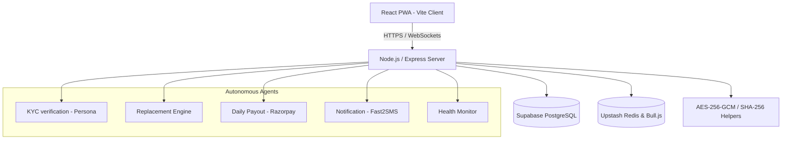

# TrustHouse System Architecture

This document explains the technical rationale, system topology, and business model design decisions behind the TrustHouse platform.

---

## 1. System Topology & Stack Selection



### Technical Rationale
* **Supabase PostgreSQL & Prisma**: Centralized PostgreSQL database managed via Prisma ORM. Ensures schema safety, transactional integrity, and efficient connection pooling.
* **Upstash Redis & Bull.js**: Offloads heavy matching logic, SMS response polling, and payout jobs to background worker queues with distributed lock protection.
* **Vite + React (ESM)**: Vite builds static assets in seconds. Using pure ES modules in Node.js matches modern specifications, enabling fast imports.
* **VWA/PWA Design**: Native service workers handle cache strategies locally, providing quick launch times on low-end Android mobile connections.
* **Performance Budget Choice**:
  * We opted for **plain CSS 3D transforms** over React Three Fiber (R3F) or Spline.
  * *Reasoning*: A Three.js canvas initialization drains memory and adds ~600KB+ of minified JS. By using GPU-accelerated CSS 3D properties (`perspective`, `transform-style: preserve-3d`, and `backface-visibility`), we achieve 60fps card rotations with zero additional bytes of bundle weight.

---

## 2. "Earned Trust" Flywheel Economics

TrustHouse implements a reputation-compounding business model where trust acts as an appreciating asset.

```
Worker behaves reliably
        ↓
Trust Score rises → Worker's commission drops (worker wins)
        ↓
Worker becomes eligible for Equity Pool bonus (worker wins)
        ↓
Worker's verified history becomes valuable beyond TrustHouse
  via Reputation API, with their consent (worker wins)
        ↓
Household treats worker fairly (incentivized by their own
  Trust Score depending partly on worker ratings)
        ↓
Household's commission drops too (household wins)
        ↓
Household buys Continuity Cover for peace of mind
  (household wins, TrustHouse earns high-margin revenue)
        ↓
Long, low-dispute, low-churn relationships dominate the
  platform → lower operational cost, higher retention
        ↓
TrustHouse's net margin improves despite lower headline
  commission rates (TrustHouse wins)
        ↓
Profit funds the Worker Equity Pool, completing the loop
```

### Commission Tier System
* **Worker Fee**: Starts at 2.0%, dropping to 1.5%, 1.0%, and finally 0.5% (after 1+ year and high ratings). This keeps workers retained on the platform long-term.
* **Household Fee**: Starts at 1.4%, dropping to 0.8% based on positive feedback ratings. This financially penalizes poor treatment of workers.

---

## 3. Autonomous Agents Architecture

Each agent is written as a discrete, testable module inside the [server/agents/](file:///C:/Users/Jay%20Prakash%20Verma/.gemini/antigravity/scratch/trusthouse/server/agents/) directory:
1. **KYC Verification Agent**: Handles Persona Hosted Flows, signs and validates incoming webhooks with timing-safe HMAC checks, and advances KYC verification states.
2. **Replacement Engine Agent**: Triggers on worker absence. Uses the Haversine formula to compute geodesic distances between on-call candidates and households. Routes offers sequentially and escalates to administrative alert lines on total matching failures.
3. **Daily Payout Agent**: Runs payout calculations. Deducts platform fees, calculates GST liabilities, registers transactions, and sends payouts via Razorpay API.
4. **Notification Agent**: Formats English and Hindi SMS templates, sending them via Fast2SMS with mock fallbacks for testing.
5. **Platform Health Monitor**: Runs scheduled connectivity audits to verify database access, Razorpay API, Firebase Auth, Persona, and Fast2SMS status.

---

## 4. Cryptography & Data Protection

* **AES-256-GCM Encryption**: Implemented in [crypto_helper.js](file:///C:/Users/Jay%20Prakash%20Verma/.gemini/antigravity/scratch/trusthouse/server/crypto_helper.js). Highly sensitive parameters (e.g. Aadhaar numbers, PAN, bank accounts) are encrypted at rest using a unique 96-bit initialization vector (IV) and verified via a 128-bit authentication tag.
* **Timing-Safe HMAC Webhook Checking**: Webhook handlers for Persona and Razorpay verify payloads using timing-safe comparisons to prevent timing side-channel exploits.
